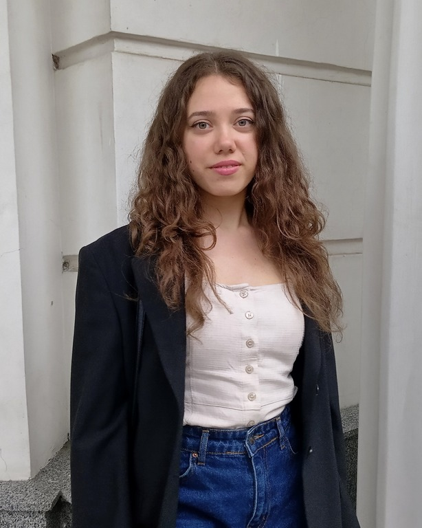

# Eugenia Minukova

## Contacts
**Phone number:** +38 099 773 77 70

**e-mail:** evgminukova6@gmail.com

**rs school nickname:** EvgeniaM6

## About me

I quickly learn new knowledge, purposeful, responsible, organized, no bad habits, lead a healthy lifestyle, have a great desire to develop and work.

## Projects
1. https://rolling-scopes-school.github.io/evgeniam6-JSFEPRESCHOOL2022Q2/travel/ - [ JS, HTML5, CSS3 ]
1. https://rolling-scopes-school.github.io/evgeniam6-JSFEPRESCHOOL2022Q2/momentum/ - [ JS, HTML5, CSS3 ]
1. https://evgeniam6.github.io/codejam-eldritch/dist/ - [ JS, HTML5, CSS3 ]
1. https://github.com/EvgeniaM6/my-rezume - [ HTML5, CSS3 ]
2. https://github.com/EvgeniaM6/rsschool-cv - [ Markdown ]

## Code examples
```
var countBits = function(n) { 
  let binary = n.toString(2).split('');
  return binary.reduce((prVal, item) => (item === '1' ? prVal + 1 : prVal), 0); 
};
```

## Work Experience

**Economist**
_**Accounting Department, Megabank**_

January 2019 - up to now

* Display of accounting entries.
* Control of the correctness of interest accrual, withholding taxes.
* Control of observance of the banking legislation of Ukraine in accounting.
* Participation in the automation of bank processes.

**Mobile banker**
_**Raiffeisen Bank Aval**_

October 2018 - December 2018

* Making calls and appointments with clients.
* Presentation and consulting on loans, credit cards of clients.
* Concluding credit agreements with clients.

## Skills
* JS
* HTML5
* CSS3
* GIT
* English level: B1

## Education

_**V. N. Karazin Kharkiv National University**_

**Finance, banking and insurance**

September 2015 - December 2020

